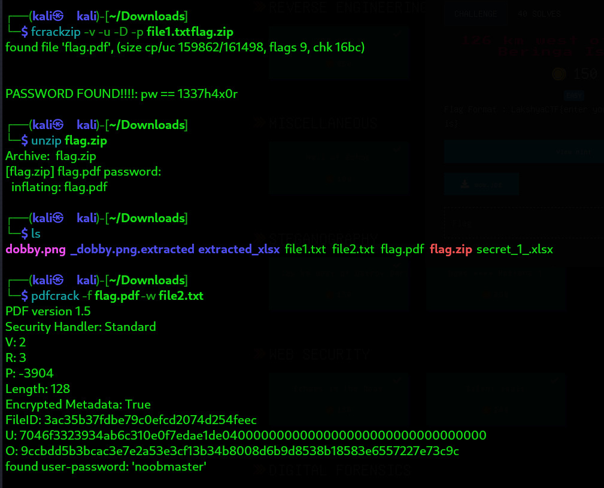

# Challenge Name: Crackkk It

- **Category**: Digital Forensics  
- **Points**: 150  
- **Difficulty**: Medium  

---

## 🧠 Challenge Description

> In this challenge, your task is to crack multiple layers of encryption to retrieve the hidden flag. The challenge consists of a password-protected ZIP file and a locked PDF document, requiring a combination of brute-force techniques and strategic decryption methods. Can you break through the layers and reveal the secret?

---

## 📁 Files Provided

[file2](../../../../../../Downloads/file2.txt)
[file1](../../../../../../Downloads/file1.txt) 
[flag.zip](../../../../../../Downloads/flag.zip)

---

## 🧩 Solution Overview

The challenge provided two **wordlists** and a **password-protected ZIP file** (`flag.zip`).
2. I noticed that **file1.txt** was a wordlist that could potentially be used for brute-forcing the ZIP file password.
3. Using the **fcrackzip** tool from John the Ripper or a similar tool, I began the brute-force process with **file1.txt** to unlock the ZIP file.
4. Once the ZIP file was unlocked, I extracted a **PDF file** from it.
5. The extracted PDF was also **password-protected**, and I could see **file2.txt** was another wordlist, which seemed like it would be used for the PDF password.
6. I then used a PDF decryption tool like **pdfcrack** and applied **file2.txt** to brute-force the PDF password.
7. After successfully unlocking the PDF, I retrieved the **flag**.
---

## 🏁 Flag
LakshyaCTF{n00bz{CR4CK3D_4ND_CR4CK3D_1a4d2e5f}}
