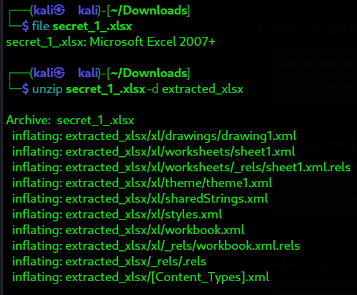
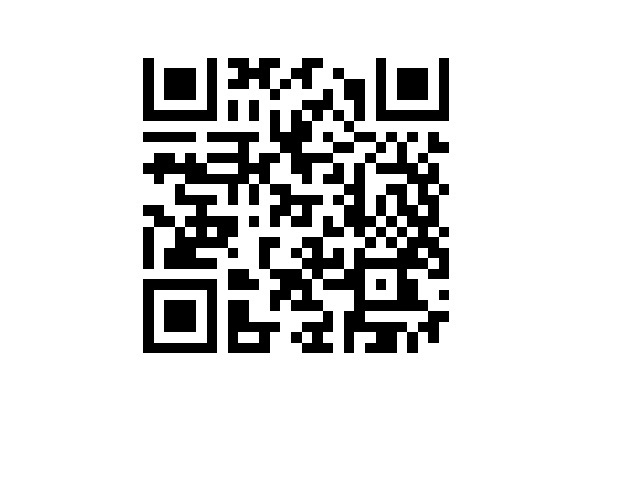

# Challenge Name: QR Chronicles

- **Category**: Digital Forensics
- **Points**: 100
- **Difficulty**: Easy  

---

## 🧠 Challenge Description

>A simple CSV file? Think again! This file hides a crucial secret within its structured data, but it's not immediately visible to the naked eye. The key to unlocking it lies in understanding the encoded coordinates stored within. Can you decipher the hidden pattern and extract the concealed information?
---

## 📁 Files Provided

[secret_1_.xlxs](../../../../../Downloads/secret_1_.xlsx)
---

## 🧩 Solution Overview

1. The file provided appeared to be a normal `.xlsx`, but something felt off.
2. I suspected it might be a **polyglot file**, so I tried unzipping it using:
   ```bash
   unzip secret_1_.xlsx -d extracted_xlxs
3. This revealed multiple XML files. I started analyzing them one by one.
4. Based on the challenge hint about coordinates, I inspected sharedStrings.xml.
5. Inside, I noticed several values that resembled coordinate pairs or points.
6. I extracted and plotted these points on a graph using Python (or by hand) to visualize them.
7. The resulting image resembled a QR code.
8. I generated an actual image of the QR code and scanned it using a QR scanner.
9. The QR code revealed the flag.
---



## 🏁 Flag
LakshyaCTF{n00bz{qr_c0d3_1n_4_t3xt_f1l3_w0w!!!!!!}}
