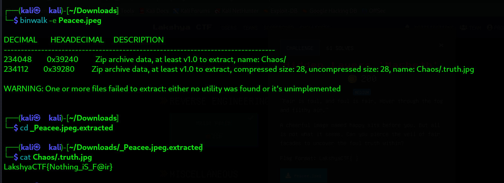

## 🕯️ Hidden Layers 'Macbeth'
**Category:** Miscellaneous  

---

### 🧠 Challenge Description

"Fair is foul, and foul is fair, Hover through the fog and filthy air." A cheerful image named happy sits before you. But all is not what it seems. Can you pierce the veil of fair facades to uncover the foul truth within?

---

## 📁 Files Provided

Peacee.jpeg

---

## 🧩 Solution Overview

1. Suspecting some steganography or file-level trickery, I ran `binwalk` to analyze embedded data:
   binwalk -e Peacee.jpeg
2. This extracted a folder named chaos/, which contained a hidden file .truth.jpg.
3. Although the file had a .jpg extension, it didn’t behave like an image. Opening it in any image viewer failed.
4. Curious, I opened the file using:
    cat chaos/.truth.jpg
The flag was sitting right there in plain text.

---

## 🏁 Flag
LakshyaCTF{Nothing_iS_F@ir}

---

## 🛠️ Tools Used

- binwalk – for extracting hidden embedded data
- cat – to reveal the hidden flag inside a misnamed file
- Basic Linux CLI skills
