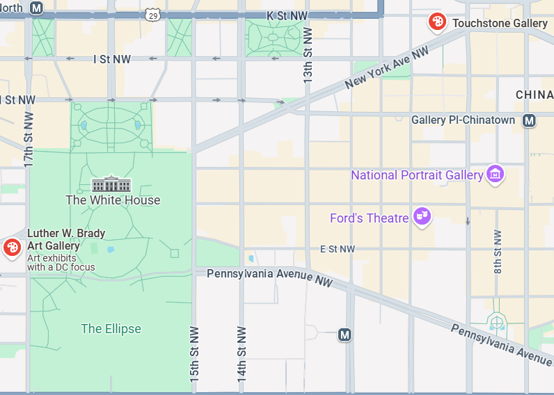

# Challenge Name: Get_The_Info

- **Category**: OSINT  
- **Points**: 150  
- **Difficulty**: Easy  

---

## 🧠 Challenge Description

> I recently took a trip to Washington, D.C., to meet Donald Trump at his residence. After the meeting, we had lunch at a famous Indian restaurant known for its Indian and Nepali cuisine — the kind of place locals rave about. From there, we walked to a nearby art gallery, all within a 0.3 mile radius. That’s where I saw a ceramic sculpture that completely captivated me. The artist, known for her ceramic work, also told me that she is having an exhibition there on March 26. I really wanted to contact her to inquire about purchasing the piece, but I lost her details. Can you help me find the email address of the artist?

---

## 📁 Files Provided

- None

---

## 🧩 Solution Overview

1. Since the person met Donald Trump, the assumption was they visited the **White House** in Washington, D.C.
2. Searched for **Indian/Nepali restaurants near the White House** on Google Maps.
3. The **closest restaurant** was **Himalayan Doko**.
4. Searched for **art galleries** within **0.3 miles** of the restaurant. The closest one was **Touchstone Gallery**.
5. On the Touchstone Gallery website, went to the **Exhibitions** section and checked the events on **March 26**.
6. Two artists were listed, but only one specialized in **ceramic art**: **Elena Tchernomazova**.
7. Searched for her contact details on her personal website, Instagram, and LinkedIn — no email address was publicly listed.
8. Guessed the email format using her full name: `elenatchernomazova@gmail.com`.
9. Submitted that email — and it turned out to be the **correct flag**.

---

## 🏁 Flag
LakshyaCTF{elenatchernomazova@gmail.com}

---

## 🛠️ Tools Used

- Google Maps  
- OSINT Techniques  
- Touchstone Gallery Website  
- Basic Email Guessing
