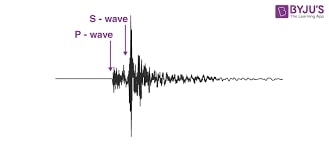
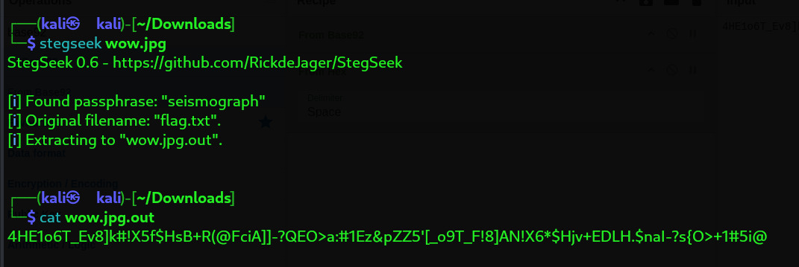

# Challenge Name: 126 km west of Ostrov Beringa Island

- **Category**: Steganography 
- **Points**: 150 
- **Difficulty**: Easy

---

## 🧠 Challenge Description

> In this challenge, your task is to crack multiple layers of encryption to retrieve the hidden flag. The challenge consists of a password-protected ZIP file and a locked PDF document, requiring a combination of brute-force techniques and strategic decryption methods. Can you break through the layers and reveal the secret?

---

## 📁 Files Provided

---

## 🧩 Solution Overview

1. The provided image, **`wow.jpg`**, appeared to be a **seismograph** at first glance.
2. I initially tried using tools like **ExifTool** and **Binwalk** to check for hidden data or file signatures, but I found nothing significant.
3. Then, I used **StegSeek**, a steganography tool, to search for hidden information in the image.
4. After running **StegSeek**, a **passphrase** and a **text file** were revealed.
5. The text file contained **gibberish-looking text**:

4HE1o6T_Ev8]k#!X5f$HsB+R(@FciA]]-?QEO>a:#1Ez&pZZ5'[_o9T_F!8]AN!X6*$Hjv+EDLH.$naI-?s{O>+1#5i@

6. This text clearly looked like it was encoded, so I decided to decode it.
7. Using **CyberChef**, I tried various decoding methods and found that the data was a combination of **Base92** and **Hex encoding**.
8. After applying both encodings, I was able to extract the **flag**.
---

## 🏁 Flag
LakshyaCTF{Stego_is_hard}