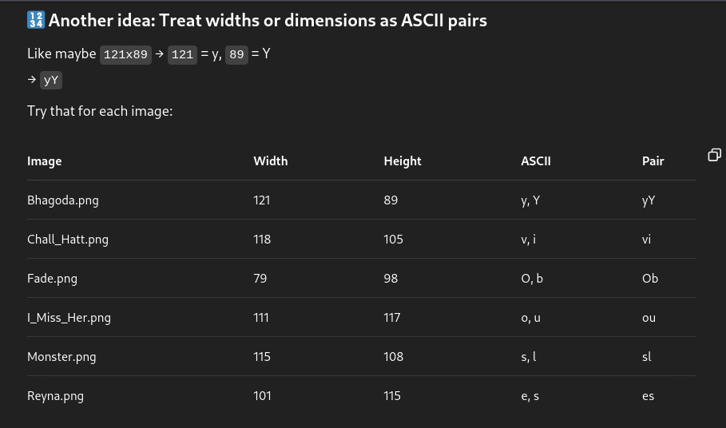

# Challenge Name: Does **** Matters ?

- **Category**: Steganography 
- **Points**: 250 
- **Difficulty**: Medium

---

## 🧠 Challenge Description

You got an image. It looks... normal. But someone swears the flag is hidden in the **** of it.
Whatever that means.
Maybe it's time to ask yourself: Does **** matters?

---

## 📁 Files Provided
 
 
 
 
 

---

## 🧩 Solution Overview

1. The 6 images provided initially seemed like normal images with no visible clues.  
2. I tried checking the metadata with **ExifTool** and looked for hidden files or data, but found nothing of interest.
3. Then, I thought about the challenge’s phrase: "**Does size matter?**"  
4. Realizing that "****" could refer to the **size** (as in the image size or aspect ratio), I decided to investigate further.
5. I checked the **aspect ratio** (width:height) of all 6 images and recorded them.
6. I then **arranged** the aspect ratios in a column and mapped them to characters.
   - I translated the aspect ratio numbers into ASCII characters.
7. When I decoded the sequence, it revealed the message: **"Obviously Yes"**.
8. Therefore, the flag was: Does size matter? **ObviouslyYes**.
---

## 🏁 Flag
size: LakshyaCTF{ObviouslyYes}

## 🛠️ Tools Used

- ExifTool  
- Manual analysis and ASCII decoding  